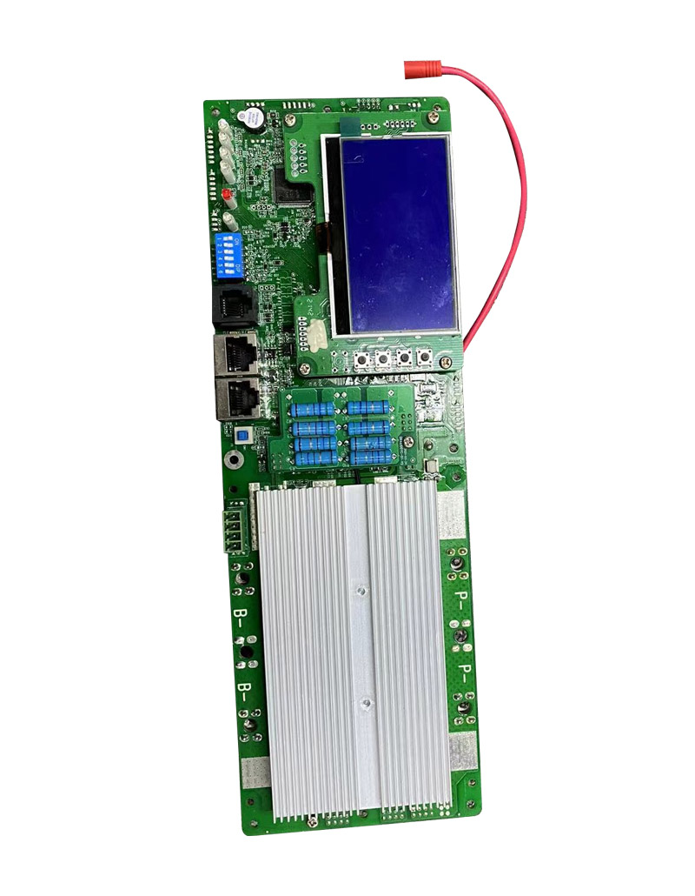
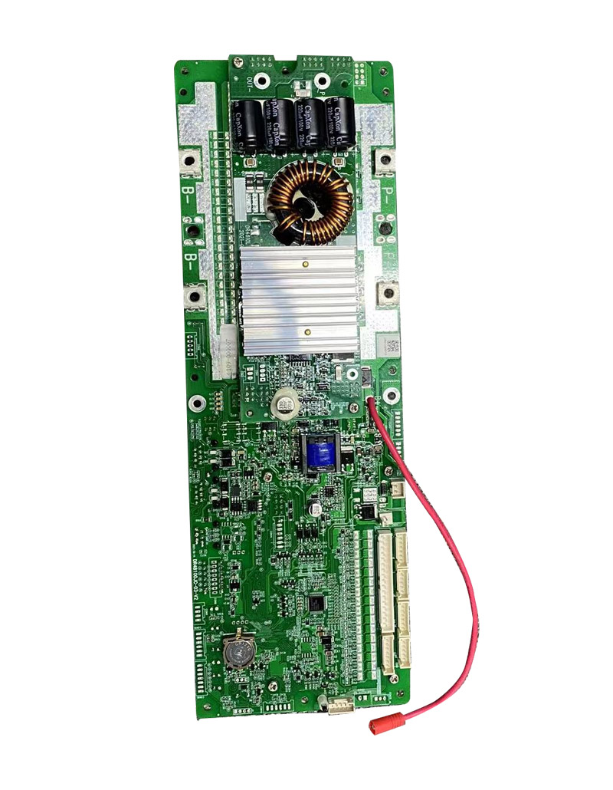

This is an **ESPHome** component that supports "**paceic**" protocol **version 20 and 25** which is used by seemingly the majority of low-cost rack-mount battery packs manufactured in SE Asia.  The BMS can be communicated with over **RS485** or **RS232** and is manufactured by PACE (or is a clone).

Example PACE BMS board:

The protocol is characterized by both requests and responses beginning with a '**~**' (tilde) character followed by two ASCII numbers either "**20**" or "**25**" and ending with a '**\r**' (carriage return) character.

I strongly encourage you to read through this entire document, but here are some Quick Links:
- [What batteries are supported?](fixme)
- [I just want an ESPHome config](fixme)
- [How do I wire my ESP to the RS485/RS232 port?](fixme)
- [I'm having a problem using this component](fixme)
- [I want to talk to a battery that isn't listed](fixme)

Paceic protocol version 20:
-
  This protocol version is spoken by older battery packs and has several variants, with firmware customized by individual manufacturers.  Three protocol variants are currently known/supported:
 - EG4
 - PYLON
 - SEPLOS

Different manufacturers will have different BMS management software (it will not be PBmsTools) but typically it speaks a variant of paceic version 20.  These older BMSes will usually have two RS485 ports (looks like an ethernet socket) and may have an RS232 port (looks like a telephone socket).  They usually won't have a CAN bus port.

There is a high likelyhood that one of these protocol variants will work for battery packs speaking protocol version 20 which are branded by a different manufacturer than those listed, but if you can find a spec doc for a new variant that behaves differently, I can probably add support.  See [here](https://github.com/nkinnan/esphome-pace-bms/protocol_documentation/paceic/0x20) for documentation on currently known version 20 protocol variants. 

Example protocol version 20 BMS front-panels:

Paceic protocol version 25: 
-
This seems more standardized, with an official protocol specification from PACE itself.  As far as I know, all newer battery packs speaking this protocol version should be supported.  See [here](https://github.com/nkinnan/esphome-pace-bms/protocol_documentation/paceic/0x25) for documentation on protocol version 25.

These BMSes speaking paceic version 25 will invariably use PBmsTools for their BMS management software (or a rebadged version of it) which looks like this:

They will typically have two RS485 ports (looks like an ethernet socket) an RS232 port (looks like a telephone socket) and possibly a CAN bus port and an LCD display as well, especially if newer.

Example protocol version 20 BMS front-panels:

Supported Values/Status (read only):
-
- All "Analog Information"
	- **Cell Count**
	- **Cell Voltage** (V) - up to x16 depending on your battery pack
	- **Temperature Count**
	- **Temperature** (°C) - up to x6 depending on your battery pack, typically this will be:
		-  *Cell Temperature* 1-4 
		- *MOSFET Temperature* 
		- *Environment Temperature*
	- **Total Voltage** (V)
	- **Current** (A) - positive or negative for charge/discharge
	- **Power** (W) - positive or negative for charge/discharge
	- **Remaining Capacity** (Ah)
	- **Full Capacity** (Ah)
	- **Design Capacity** (Ah)
	- **State of Charge** (%)
	- **State of Health** (%)
	- **Cycle Count**
	- **Minimum Cell Voltage** (V)
	- **Maximum Cell Voltage** (V)
	- **Average Cell Voltage** (V)
	- **Max Cell Differential** (V) - difference between minimum and maximum cell voltage
- All "Status Information" information decoded to human-readable text format
	- **Warning Text** - A list of any warnings reported by the BMS
	- **Protection Text** - If the BMS has protected itself or the batteries, for example disabling charging if the temperature is too low, or a cell voltage is too high, it will be listed here
	- **Fault Text** - A list of any faults reported by the BMS
	- **System Text** - Current system status such as "Charging"
	- **Configuration Text** - System configuration such as "Warning Buzzer Enabled"
	- **Balancing Text** - If any cells are currently balancing, they will be listed here
	- (individual status flag values) - These are what the text fields are decoded from, and are documented separately.  You probably won't need them, but they are available.  There are a lot of them and they vary by protocol version and variant.
(READ/WRITE)
- **Hardware Version** - The BMS hardware version (string)
- **Serial Number** - The BMS serial number (string)

Supported Configuration (read / write):
-
- **System Date and Time** - Allows access to the BMS internal real-time clock 
- **Shutdown** - A button which sends the shutdown command to the BMS

Supported Configuration (read / write) version 25 ONLY:
-
- Toggles (switches) that turn various features on/off
	- **Buzzer Alarm**
	- **LED Alarm**
	- **Charge Current Limiter**
	- **Charge MOSFET**
	- **Discharge MOSFET**
- Selects (drop-lists) that allow configuring various features
	- **Charge Current Limiter Gear** - set to High or Low
	- **Protocol (CAN)** - Allows selection of various protocols spoken on the CAN bus, typically to match your inverter
	- **Protocol (RS485)** - Allows selection of various protocols spoken on the RS485 bus, typically to match your inverter
	- **Protocol Type** - Auto or Manual
- Configuration
  - Cell Over Voltage
	- **Cell Over Voltage Alarm** (V)
	- **Cell Over Voltage Protection** (V)
	- **Cell Over Voltage Protection Release** (V)
	- **Cell Over Voltage Delay** (seconds)
  - Pack Over Voltage
	- **Pack Over Voltage Alarm** (V)
	- **Pack Over Voltage Protection** (V)
	- **Pack Over Voltage Protection Release** (V)
	- **Pack Over Voltage Delay** (seconds)
  - Cell Under Voltage
	- **Cell Under Voltage Alarm** (V)
	- **Cell Under Voltage Protection** (V)
	- **Cell Under Voltage Protection Release** (V)
	- **Cell Under Voltage Delay** (seconds)
  - Pack Under Voltage
	- **Pack Under Voltage Alarm** (V)
	- **Pack Under Voltage Protection** (V)
	- **Pack Under Voltage Protection Release** (V)
	- **Pack Under Voltage Delay** (seconds)
  - Discharge Over Current 1
	- **Discharge Over Current 1 Alarm** (V)
	- **Discharge Over Current 1 Protection** (V)
	- **Discharge Over Current 1 Delay** (seconds)
  - Discharge Over Current 2
	- **Discharge Over Current 2 Protection** (V)
	- **Discharge Over Current 2 Delay** (seconds)
  - Discharge Short Circuit
	- **Discharge Short Circuit Protection Delay** (milliseconds)
  - Cell Balancing
	- **Cell Balancing Threshold** (V)
	- **Cell Balancing Delta** (V)
  - Sleep
	- **Sleep Cell Voltage** (V)
	- **Sleep Delay** (minutes)
  - Full Charge
	- **Full Charge Voltage** (V)
	- **Full Charge Amps** (A)
  - Low Charge
	- **Low Charge Alarm** (%)
  - Charge Over Temperature
	- **Charge Over Temperature Alarm** (°C)
	- **Charge Over Temperature Protection** (°C)
	- **Charge Over Temperature Protection Release** (°C)
  - Discharge Over Temperature
	- **Discharge Over Temperature Alarm** (°C)
	- **Discharge Over Temperature Protection** (°C)
	- **Discharge Over Temperature Protection Release** (°C)
  - Charge Under Temperature
	- **Charge Under Temperature Alarm** (°C)
	- **Charge Under Temperature Protection** (°C)
	- **Charge Under Temperature Protection Release** (°C)
  - Discharge Under Temperature
	- **Discharge Under Temperature Alarm** (°C)
	- **Discharge Under Temperature Protection** (°C)
	- **Discharge Under Temperature Protection Release** (°C)
  - MOSFET Over Temperature
	- **MOSFET Over Temperature Alarm** (°C)
	- **MOSFET Over Temperature Protection** (°C)
	- **MOSFET Over Temperature Protection Release** (°C)
  - Environment Over Temperature
	- **Environment Over Temperature Alarm** (°C)
	- **Environment Over Temperature Protection** (°C)
	- **Environment Over Temperature Protection Release** (°C)
  - Environment Under Temperature
	- **Environment Under Temperature Alarm** (°C)
	- **Environment Under Temperature Protection** (°C)
	- **Environment Under Temperature Protection Release** (°C)

